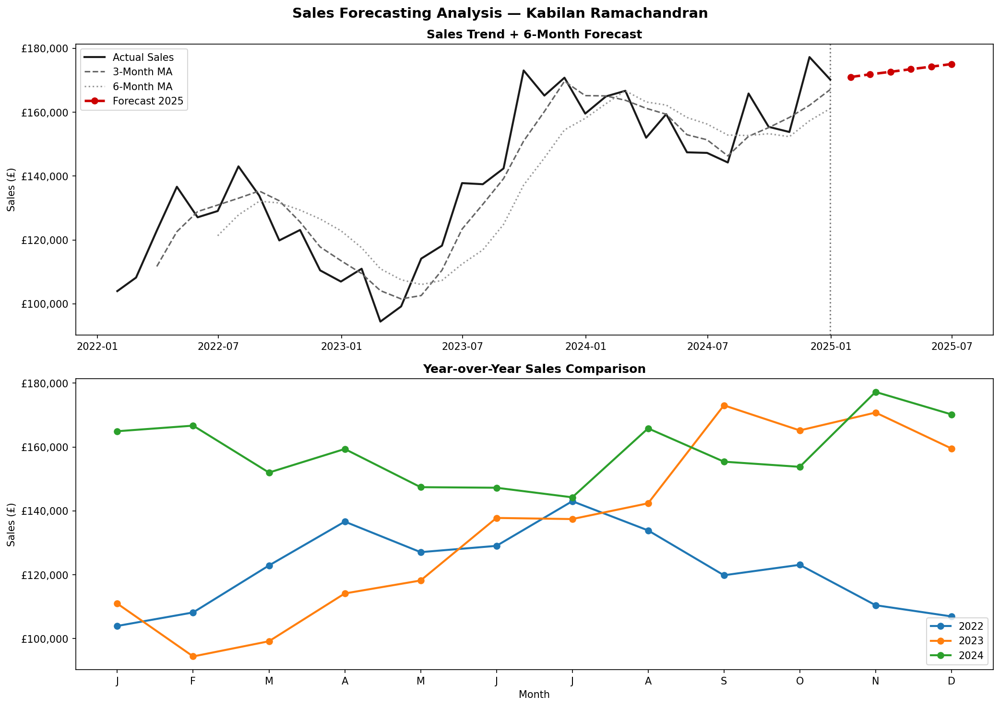

# Sales Forecasting Analysis — Python

## Project Overview
Time series analysis and 6-month sales forecasting using
moving averages and trend analysis on 3 years of sales data.

## Tools & Skills
- Python — Pandas, NumPy, Matplotlib
- Time Series Analysis — Moving averages, trend decomposition
- Forecasting — 6-month forward projection
- YoY Comparison — Annual performance benchmarking

## Key Insights
- Sales grew consistently from 2022 to 2024
- Clear seasonal pattern identified — peaks mid-year
- 6-month forecast projects continued growth trend
- 3-month moving average smooths volatility effectively

## Dashboard

## Author
**Kabilan Ramachandran** · linkedin.com/in/kabilan-ramachandran
